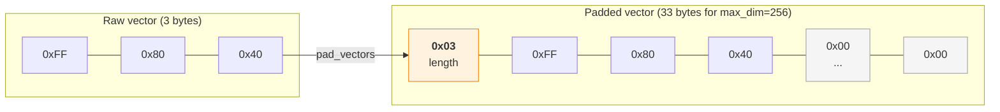
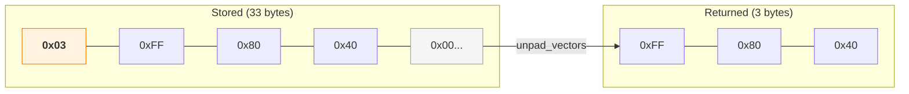

# Architecture

## The core problem

USearch requires all vectors in an index to have the same dimensionality. ISCC codes are
variable-length (64-bit to 256-bit). `iscc-usearch` solves this with **length-prefixed padding**
and a **custom metric** that ignores padding during distance computation.

## Length-prefixed padding

Every vector is padded to a uniform size before storage. The first byte holds the original vector
length (in bytes), then the vector data, then zero-padding:

The padded vector is stored in USearch as a `ScalarKind.B1` (binary) vector with
`ndim = max_dim + 8` bits (the extra 8 bits account for the length byte).

On retrieval, `unpad_vectors` reads the length byte and returns only the valid data bytes:

Both `pad_vectors` and `unpad_vectors` are compiled with Numba `@njit(cache=True)` for native speed.

## Custom metric restoration

USearch serializes the metric *kind* (e.g., Hamming) but not the custom function pointer. When an
index is loaded or viewed, USearch substitutes the standard metric for that kind. Since NPHD is
registered as `MetricKind.Hamming` (the closest built-in kind), a loaded index would use standard
Hamming distance instead of NPHD.

`NphdIndex.load()` and `NphdIndex.view()` call `change_metric()` after every load or view to
restore the NPHD function pointer. This happens automatically and callers never need to do it
manually.

## Numba compilation strategy

Two compilation modes are used:

- **`@cfunc`** for the NPHD metric: produces a C-callable function pointer compatible with
    USearch's `CompiledMetric` interface. USearch calls it from C++ during graph traversal without
    crossing the Python/C boundary.

- **`@njit(cache=True)`** for padding functions: JIT-compiled with result caching so recompilation
    cost is paid only once per environment. Operates on NumPy arrays.

## Why a thin wrapper

`iscc-usearch` does not fork USearch's index logic. It wraps the existing `Index` class, adds
padding at the boundary, and restores the metric after persistence operations. This keeps the
wrapper small and lets it track upstream USearch improvements without merge conflicts.

The one exception is the [patched usearch fork](performance.md), which modifies USearch's C++ core
for performance. Those patches are confined to view/load paths and don't change the index format.
