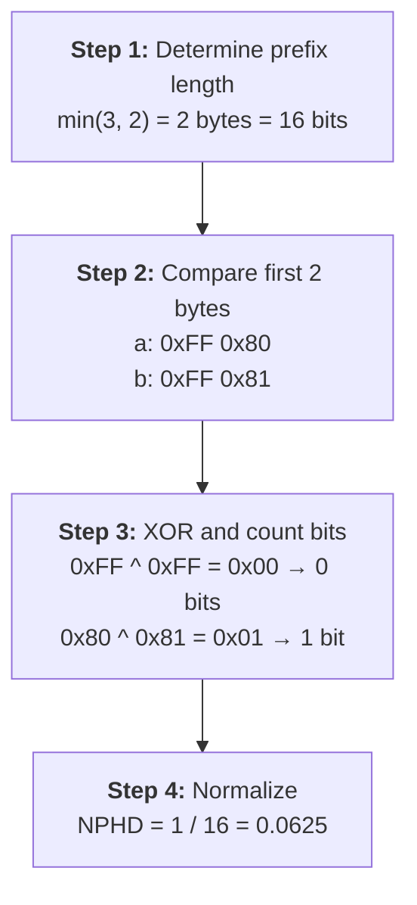

# Normalized Prefix Hamming Distance (NPHD)

## The problem with standard Hamming distance

Standard Hamming distance counts the positions where two equal-length bit-strings differ. It is
undefined for vectors of different lengths -- you cannot compare a 64-bit code with a 256-bit code
without deciding what to do about the 192 extra bits.

Common workarounds like zero-padding or truncation either introduce artificial differences or
discard information. Neither preserves the prefix relationship that ISCC codes rely on.

## NPHD definition

NPHD compares only the **common prefix** (the shorter of the two vectors) and normalizes by its
length:

$$
\text{NPHD}(a, b) = \frac{\text{hamming}(a_{1..m},\; b_{1..m})}{m \times 8}
$$

where $m = \min(\text{len}(a),\; \text{len}(b))$ in bytes.

- **Numerator**: Hamming distance over the first $m$ bytes (the common prefix).
- **Denominator**: $m \times 8$ (the number of bits in the prefix).

## Worked example

Take two vectors:

- **a** = `[0xFF, 0x80, 0x40]` (3 bytes, 24 bits)
- **b** = `[0xFF, 0x81]` (2 bytes, 16 bits)

The third byte of **a** (`0x40`) is ignored because **b** is only 2 bytes long.

## Metric properties

NPHD satisfies the metric axioms for vectors that share a common prefix hierarchy:

| Property                | Holds? | Explanation                                                     |
| ----------------------- | ------ | --------------------------------------------------------------- |
| **Identity**            | Yes    | $\text{NPHD}(a, a) = 0$ for any vector $a$                      |
| **Symmetry**            | Yes    | $\text{NPHD}(a, b) = \text{NPHD}(b, a)$ by commutativity of XOR |
| **Triangle inequality** | Yes    | Follows from normalized Hamming on the shared prefix            |
| **Non-negativity**      | Yes    | Hamming distance is always $\geq 0$                             |

## Distance range

NPHD values fall in $[0.0,\; 1.0]$ regardless of vector lengths:

- **0.0** -- The common prefix is identical.
- **1.0** -- Every bit in the common prefix differs.

Distances are directly comparable even when the vectors have different lengths.

## Connection to ISCC (ISO 24138)

[ISCC](https://iscc.codes) content codes are **prefix-compatible**: a 64-bit ISCC code is the most
significant portion of a 256-bit code. Searching a mixed-resolution index with NPHD works because
the metric respects this nesting.

## Connection to Matryoshka Representation Learning

ISCC's prefix-compatible design shares a conceptual basis with
[Matryoshka Representation Learning (MRL)](https://arxiv.org/abs/2205.13147), where embeddings are
structured so that truncating to a shorter prefix preserves the most important information.
NPHD is the metric counterpart: it compares representations at any truncation level with distances
that are comparable across resolutions.

## Implementation

The NPHD metric is compiled to a C-callable function with Numba's `@cfunc` decorator and passed to
USearch's C++ core as a function pointer. This avoids Python callback overhead on every distance
computation during graph traversal. See `iscc_usearch.metrics` for the source.
