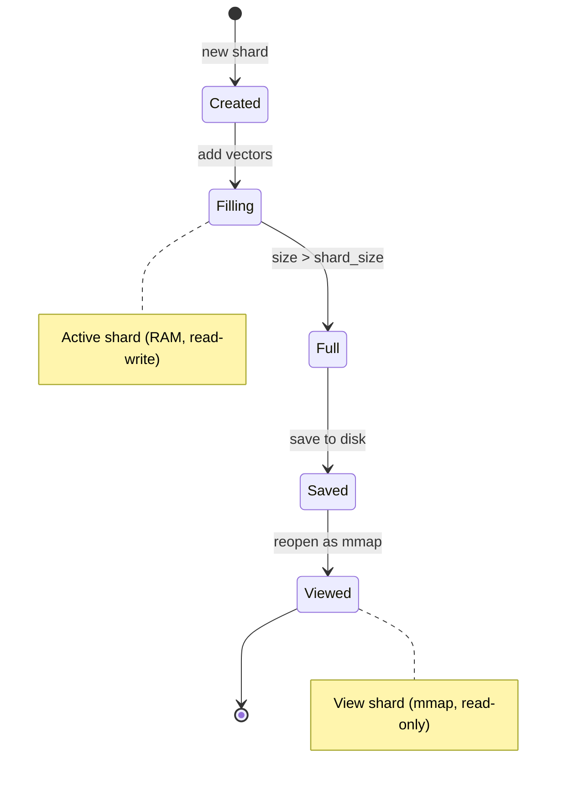
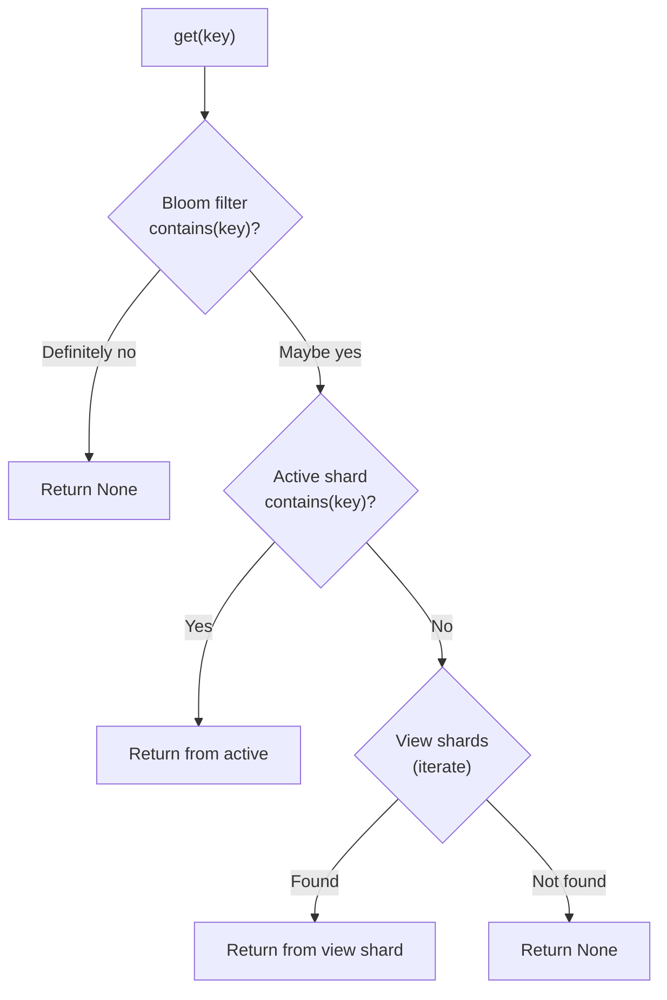

# Sharding design

## The problem

HNSW graph construction slows as the graph grows because each insertion must search a larger
neighborhood. A single USearch `Index` averages ~11.7K vectors/sec over 1M inserts, with throughput
declining throughout. At hundreds of millions of vectors, this is a bottleneck.

A single index file must also fit in RAM for writes. Memory-mapping helps for reads, but
write-heavy workloads need the full graph loaded.

## Active shard vs. view shards

`ShardedIndex` splits storage into two tiers:

- **Active shard** (one, fully loaded in RAM): handles all writes. Stays small for consistent
    insert throughput.
- **View shards** (zero or more, memory-mapped): handle reads. Memory footprint is low because the
    OS pages data in on demand.

When the active shard exceeds the configured `shard_size`, it is:

1. Saved to disk as `shard_NNN.usearch`.
1. Reopened in view mode (memory-mapped, read-only).
1. Replaced by a fresh, empty active shard.

This rotation resets the HNSW insert curve and keeps throughput consistent.

## Bloom filter integration

`ShardedIndex` has a `ScalableBloomFilter` that tracks all keys across all shards. This allows
O(1) rejection of non-existent keys in `get()`, `contains()`, and `count()`:

Without the bloom filter, every key lookup must query each shard sequentially. With the bloom
filter, keys that don't exist are rejected instantly.

The bloom filter is:

- Persisted alongside shard files as `bloom.isbf`.
- Updated automatically when vectors are added.
- Rebuilt via `rebuild_bloom()` if corrupted or missing.

## Search fan-out

Each search query fans out across all shards, then results are merged. View shards are searched
via USearch's `Indexes` class (which may parallelize internally), and the active shard is
searched separately. The two result sets are then combined:

1. Query all view shards (via `Indexes.search()`).
1. Query the active shard.
1. Merge results using vectorized NumPy operations (concatenate, argsort, advanced indexing).
1. Return top-k results sorted by distance.

## Trade-offs

| Factor         | Fewer shards (large shard_size)    | More shards (small shard_size)     |
| -------------- | ---------------------------------- | ---------------------------------- |
| Query latency  | Lower (fewer shards to search)     | Higher (more shards to merge)      |
| Add throughput | Degrades as shard fills            | Stays consistent (frequent resets) |
| Memory usage   | Higher (large active shard in RAM) | Lower (small active shard)         |
| Disk I/O       | Less frequent rotation             | More frequent rotation             |

The default `shard_size` of 1 GB is a reasonable starting point for most workloads. Tune it based
on your read/write ratio -- see [Performance](performance.md) for benchmark data.

## Append-only design

`ShardedIndex` is append-only:

- No `remove()`: view shards are read-only and USearch does not support efficient single-key
    deletion from memory-mapped files.
- No `clear()` / `reset()`: would require coordinating across multiple shard files.
- No `copy()`: would require deep-copying multiple memory-mapped files.

This keeps the implementation simple and predictable. If you need updates, use `NphdIndex` with
`upsert()` (single-file only).
