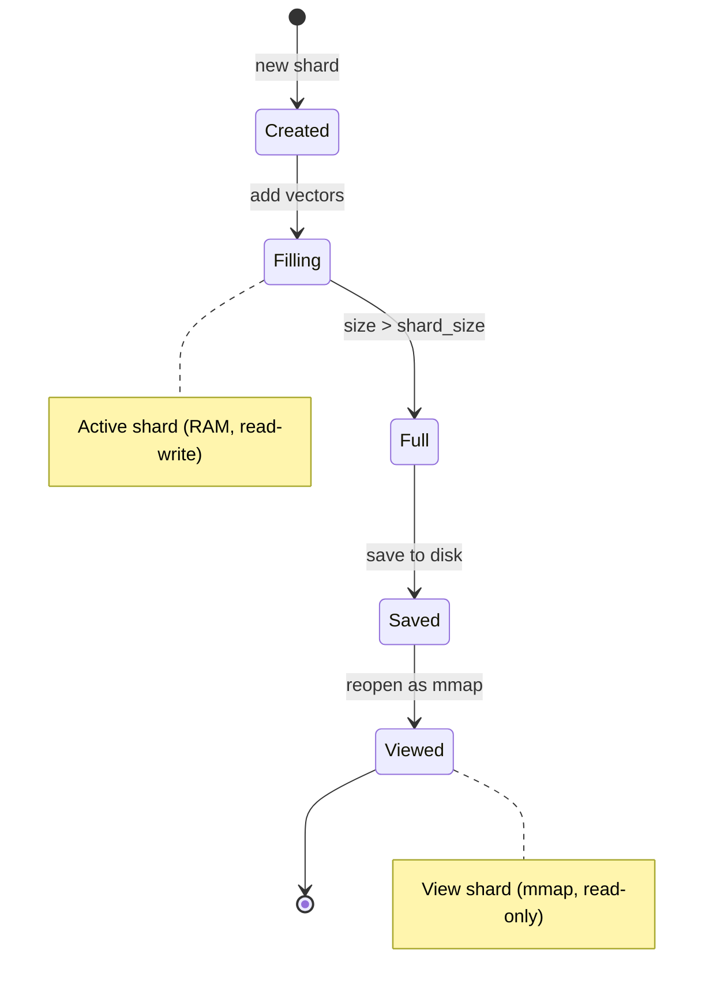
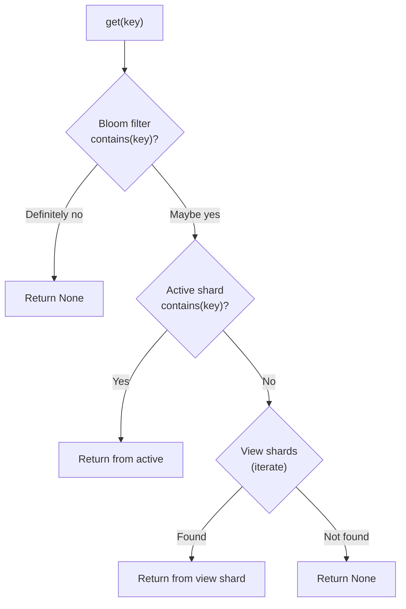

# Sharding design

## The problem

HNSW graph construction slows as the graph grows because each insertion must search a larger
neighborhood. A single USearch `Index` averages ~11.7K vectors/sec over 1M inserts, with throughput
declining throughout. At hundreds of millions of vectors, this is a bottleneck.

A single index file must also fit in RAM for writes. Memory-mapping helps for reads, but
write-heavy workloads need the full graph loaded.

## Active shard vs. view shards

`ShardedIndex` splits storage into two tiers:

- **Active shard** (one, fully loaded in RAM): handles all writes. Stays small for consistent
    insert throughput.
- **View shards** (zero or more, memory-mapped): handle reads. Memory footprint is low because the
    OS pages data in on demand.

When the active shard exceeds the configured `shard_size`, it is:

1. Bloom filter and shard file saved durably (buffer → fdatasync → atomic rename).
1. Tombstones persisted after the shard is durable.
1. Shard reopened in view mode (memory-mapped, read-only).
1. Replaced by a fresh, empty active shard.

This rotation resets the HNSW insert curve and keeps throughput consistent. The
bloom → shard → tombstones ordering ensures that tombstone removals only become visible after
the shard data they depend on is safely on disk.

## Background shard rotation

By default, shard rotation is synchronous — `add()` blocks while the full shard is serialized,
written to disk, and reopened as a view. For write-heavy workloads, this stall can be
significant.

With `background_rotation=True`, the rotation pipeline changes:

1. Bloom filter persisted (synchronous — fast, small file).
1. Tombstone state captured as an in-memory snapshot.
1. Old active shard detached and handed to a single-threaded executor.
1. New active shard created immediately — `add()` returns.
1. Background thread: serializes shard (with GIL released), calls `durable_write`, persists
    tombstone snapshot, memory-maps the shard as a view.
1. On completion, the view shard is registered and becomes searchable.

The background thread uses `release_gil=True` on `save_index_to_buffer` so the main thread can
continue Python work (bloom filter updates, active shard inserts) while serialization runs.

### Backpressure

If `max_pending_rotations` tasks queue up (default: 2), the next rotation blocks until the
oldest pending task completes. This prevents unbounded memory growth from accumulating detached
shards.

### Drain semantics

`drain_rotations()` waits for all pending background rotations, registering each as a view
shard. It retries failed rotations once before raising. Key-dependent operations (`upsert`,
`add_once`, `save`, `compact`, `reset`) call `drain_rotations()` automatically.
`add()` and `remove()` call `_register_completed_rotations()` — a non-blocking check that
registers finished tasks without waiting. `remove()` searches pending rotation shards directly
in memory: keys found only there receive per-shard deferred tombstones that merge into
`_tombstones` when the rotation registers. Re-adding a key discards its deferred tombstone so
the fresh copy is never shadowed.

### Tombstone snapshots

Background rotation captures tombstone state at rotation time via `_capture_tombstone_data()`.
The background thread persists this snapshot after `durable_write`, preserving the
shard-before-tombstones ordering from the synchronous path.

## Bloom filter integration

`ShardedIndex` has a `ScalableBloomFilter` that tracks all keys across all shards. This allows
O(1) rejection of non-existent keys in `get()`, `contains()`, and `count()`:

Without the bloom filter, every key lookup must query each shard sequentially. With the bloom
filter, keys that don't exist are rejected instantly.

The bloom filter is:

- Persisted alongside shard files as `bloom.isbf`.
- Updated automatically when vectors are added.
- Rebuilt automatically on load if the file is missing or corrupt.
- Rebuilt manually via `rebuild_bloom()` if needed.

## Search fan-out

Each search query fans out across all shards, then results are merged. View shards are searched
via USearch's `Indexes` class (which may parallelize internally), and the active shard is
searched separately. The two result sets are then combined:

1. Query all view shards (via `Indexes.search()`).
1. Query the active shard.
1. Merge results using vectorized NumPy operations (concatenate, argsort, advanced indexing).
1. Return top-k results sorted by distance.

## Trade-offs

| Factor         | Fewer shards (large shard_size)    | More shards (small shard_size)     |
| -------------- | ---------------------------------- | ---------------------------------- |
| Query latency  | Lower (fewer shards to search)     | Higher (more shards to merge)      |
| Add throughput | Degrades as shard fills            | Stays consistent (frequent resets) |
| Memory usage   | Higher (large active shard in RAM) | Lower (small active shard)         |
| Disk I/O       | Less frequent rotation             | More frequent rotation             |

The default `shard_size` of 1 GB is a reasonable starting point for most workloads. Tune it based
on your read/write ratio -- see [Performance](performance.md) for benchmark data.

## Tombstone-based deletion

View shards are memory-mapped and read-only at the filesystem level. `remove()` handles this by
using two strategies:

- **Active shard entries**: removed immediately via USearch's lazy deletion (the HNSW node is
    marked as deleted internally).
- **View shard entries**: tracked in a `_tombstones` set. Tombstoned keys are suppressed in search
    results and iterators without modifying the view shard files.

Tombstones are persisted as `tombstones.npy` alongside shard files, so deletion state survives
save/load cycles.

### Compaction

Over time, tombstoned entries waste disk space and increase search fan-out overhead. `compact()`
rebuilds view shards to physically remove tombstoned and cross-shard duplicate entries:

1. Collect live entries from each view shard (newest-to-oldest, active shard keys authoritative).
1. Release all memory-mapped references (required on Windows).
1. Rebuild shard files containing only live entries; delete empty shards.
1. Reopen rebuilt shards in view mode, rebuild the bloom filter, and save.

Compaction is optional — tombstoned entries are already filtered from reads. Compact when disk
space matters or tombstone density is high.

### Dirty counter

All writable indexes expose a `dirty` property that counts unsaved key mutations (adds and
removes). It resets to 0 on `save()` and `reset()` but not on shard rotation — bloom filter and
tombstone state may still need flushing. Read-only indexes always return 0. Use `dirty` to
implement caller-driven flush policies (e.g., "save every 1000 writes").

### Additional operations

- `upsert()` provides insert-or-update semantics by calling `remove()` then `add()`. Batch upsert
    deduplicates within the batch (last occurrence wins).
- `add_once()` provides skip-if-exists semantics — it adds a vector only when its key does not
    already exist. Useful for idempotent batch loads.
- `reset()` releases all in-memory resources (view shards, active shard, bloom filter, tombstones)
    without deleting files on disk.
