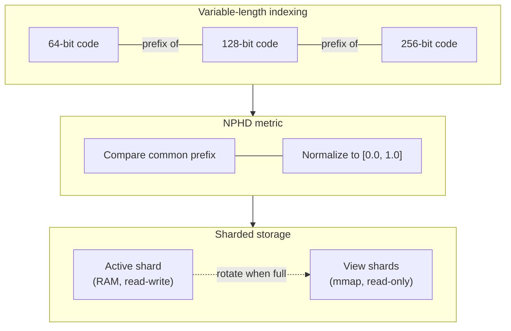

# iscc-usearch

[](https://github.com/iscc/iscc-usearch/actions/workflows/tests.yml)
[](https://www.python.org/downloads/)
[](https://github.com/iscc/iscc-usearch/blob/main/LICENSE)

**Scalable approximate nearest neighbor search for variable-length binary bit-vectors.**

`iscc-usearch` extends [USearch](https://github.com/unum-cloud/usearch) with capabilities
purpose-built for [ISCC](https://iscc.codes) (ISO 24138) content fingerprints: indexing
binary vectors of mixed bit-lengths in a single index, and scaling beyond available RAM through
transparent sharding.

## Why not plain USearch?

USearch is a fast, general-purpose vector index -- but it assumes all vectors have the same
dimensionality, and a single index must fit in memory for writes. ISCC codes break both
assumptions:

- **Variable-length codes.** An ISCC content fingerprint can be 64, 128, or 256 bits depending
    on resolution. Shorter codes are prefixes of longer ones -- a design shared with
    [Matryoshka Representation Learning](https://arxiv.org/abs/2205.13147). A useful index must
    store and compare all resolutions together.

- **Large-scale collections.** Real-world content registries grow to hundreds of millions of
    fingerprints. Write throughput in HNSW graphs degrades as the graph grows, and the full graph
    must be loaded into RAM for inserts.

`iscc-usearch` solves both problems with two core additions:



**Normalized Prefix Hamming Distance (NPHD)** compares only the bits that both vectors share and
normalizes the result to `[0.0, 1.0]`. A 64-bit query can find its nearest neighbors among
256-bit vectors -- distances remain comparable across resolutions.

**Transparent sharding** keeps a single active shard in RAM for writes while completed shards are
memory-mapped for reads. This maintains consistent insert throughput regardless of index size and
keeps the memory footprint bounded.

## Which index class?

| Class              | Variable length | Sharding | Upsert | Use when...                                               |
| ------------------ | --------------- | -------- | ------ | --------------------------------------------------------- |
| `NphdIndex`        | yes             | no       | yes    | Dataset fits in RAM                                       |
| `ShardedNphdIndex` | yes             | yes      | no     | Dataset exceeds RAM or needs consistent insert throughput |

Both support 64/128/256-bit ISCC codes in the same index. See the
[architecture overview](explanation/architecture.md#choosing-an-index-class) for the full class
hierarchy.

## Quick start

```bash
pip install iscc-usearch
```

```python
import numpy as np
from iscc_usearch import NphdIndex

index = NphdIndex(max_dim=256)

# Mix 64-bit and 128-bit vectors in the same index
index.add(1, np.array([255, 128, 64, 32, 16, 8, 4, 2], dtype=np.uint8))
index.add(2, np.array([255, 128, 64, 32, 16, 8, 4, 2, 1, 0, 255, 128, 64, 32, 16, 8], dtype=np.uint8))

# Search with a 64-bit query -- NPHD compares the common prefix
query = np.array([255, 128, 64, 32, 16, 8, 4, 2], dtype=np.uint8)
matches = index.search(query, count=2)

print(matches.keys)  # Nearest neighbor keys
print(matches.distances)  # NPHD distances in [0.0, 1.0]
```

## Documentation

<div class="grid cards" markdown>

- **[Tutorials](tutorials/getting-started.md)** -- Learn the basics

    Hands-on guides from installation to working code.

- **[How-to guides](howto/persistence.md)** -- Solve specific problems

    Recipes for persistence, sharding, upsert, and bloom filters.

- **[Explanation](explanation/nphd-metric.md)** -- Understand the design

    Background on NPHD, architecture, sharding, and performance.

- **[Reference](reference/api.md)** -- API details

    Auto-generated API documentation for all public classes.

- **[Development](development/contributing.md)** -- Contribute

    Dev setup, testing, and contribution guidelines.

</div>
