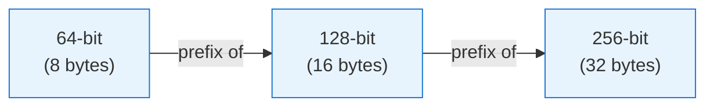

# Variable-Length Vectors

This tutorial builds on the [Getting Started](getting-started.md) guide. You will add vectors of
different bit-lengths to the same index and observe how the NPHD metric handles prefix matching.

## The prefix relationship

In ISCC content fingerprinting, a shorter code is a valid prefix of a longer one. A 64-bit code
contains the most significant bits; a 128-bit code extends it with more detail; a 256-bit code is
the full-resolution fingerprint.



`iscc-usearch` supports storing all these lengths in a single index and comparing them using the
Normalized Prefix Hamming Distance (NPHD).

## Create an index and add mixed-length vectors

```python
import numpy as np
from iscc_usearch import NphdIndex

index = NphdIndex(max_dim=256)

# 64-bit vector (8 bytes)
v64 = np.array([255, 128, 64, 32, 16, 8, 4, 2], dtype=np.uint8)

# 128-bit vector (16 bytes) -- first 8 bytes match v64
v128 = np.array([255, 128, 64, 32, 16, 8, 4, 2, 1, 0, 255, 128, 64, 32, 16, 8], dtype=np.uint8)

# 256-bit vector (32 bytes) -- first 16 bytes match v128
v256 = np.array(
    [
        255,
        128,
        64,
        32,
        16,
        8,
        4,
        2,
        1,
        0,
        255,
        128,
        64,
        32,
        16,
        8,
        7,
        6,
        5,
        4,
        3,
        2,
        1,
        0,
        255,
        254,
        253,
        252,
        251,
        250,
        249,
        248,
    ],
    dtype=np.uint8,
)

index.add(1, v64)
index.add(2, v128)
index.add(3, v256)
```

## Search with a short query

When you search with a 64-bit query, NPHD compares only the first 64 bits of each stored vector
(the common prefix):

```python
query = v64.copy()
matches = index.search(query, count=3)

for key, dist in zip(matches.keys, matches.distances):
    print(f"Key {key}: distance = {dist:.4f}")
```

Expected output:

```
Key 1: distance = 0.0000
Key 2: distance = 0.0000
Key 3: distance = 0.0000
```

All three vectors share the same 64-bit prefix, so the distance is `0.0` for all of them.

## Search with a longer query

Now search with the full 128-bit vector. NPHD compares up to 128 bits against vectors that are at
least 128 bits long, but still only 64 bits against the 64-bit vector:

```python
query = v128.copy()
matches = index.search(query, count=3)

for key, dist in zip(matches.keys, matches.distances):
    print(f"Key {key}: distance = {dist:.4f}")
```

The 128-bit and 256-bit vectors match perfectly over 128 bits, while the 64-bit vector matches
perfectly over its 64-bit prefix.

## Understanding NPHD distances

NPHD normalizes the Hamming distance by the length of the shorter vector:

```
NPHD(a, b) = hamming(prefix_a, prefix_b) / min(bits_a, bits_b)
```

Key properties:

- **Range**: Always `[0.0, 1.0]` regardless of vector lengths.
- **Prefix compatibility**: A 64-bit vector that matches the first 64 bits of a 256-bit vector
    yields distance `0.0`.
- **Symmetry**: `NPHD(a, b) == NPHD(b, a)`.

For a deeper treatment, see the [NPHD Metric explanation](../explanation/nphd-metric.md).

## Introduce a difference

Add a vector that differs by one bit in the first byte:

```python
v64_diff = np.array([254, 128, 64, 32, 16, 8, 4, 2], dtype=np.uint8)  # 254 vs 255
index.add(4, v64_diff)

matches = index.search(v64, count=4)
for key, dist in zip(matches.keys, matches.distances):
    print(f"Key {key}: distance = {dist:.6f}")
```

The distance between `v64` and `v64_diff` is `1/64 = 0.015625` -- one bit differs out of 64 total
bits.

## Next steps

- **[NPHD Metric](../explanation/nphd-metric.md)** -- Detailed explanation of the metric's
    mathematical properties.
- **[Architecture](../explanation/architecture.md)** -- How variable-length vectors are stored
    internally.
